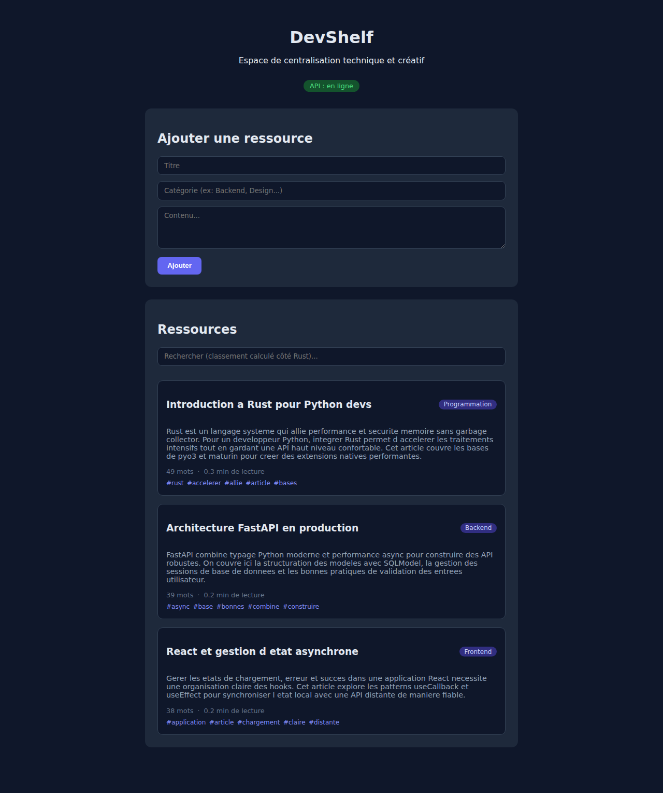
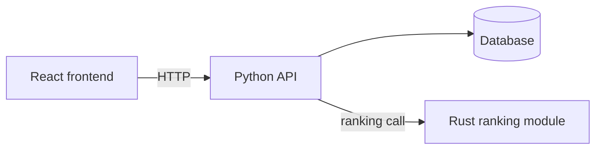

# DevShelf

**A technical resource library with a Python API and search ranking computed in Rust.**

Save articles, notes and snippets, tag them by category, and find them again with a relevance-ranked search.



<!-- TODO: replace with a full-page capture (3-4 resources visible) or a short GIF: add a resource, then search and watch the ranking change. -->

> The interface and the sample data are in French. The code, the API and this documentation are in English.

## What it does

- **Add resources** with a title, a category and a body of text
- **Search with relevance ranking**, computed in a Rust module rather than in Python
- **Automatic metadata**: word count, estimated reading time and keyword tags
- **Live API status** shown in the UI

## Why it is built this way

This project is a small but complete stack, chosen to show how the pieces fit together rather than to be large:

| Layer | Role |
| --- | --- |
| React frontend | Add and browse resources, search box, API status badge |
| Python API | HTTP endpoints, validation, persistence |
| Rust module | Search ranking (the performance-sensitive part) |
| Database | Stores resources |

<!-- TODO: name the exact tools (web framework, ORM, database, Python<->Rust bridge). Example: "FastAPI + SQLModel, PyO3 built with maturin, SQLite". Only write what is really in the repo. -->



## Getting started

<!-- TODO: replace with the real commands, and test them from a clean clone. -->

```bash
# 1. Clone
git clone https://github.com/as9ardth0r/devshelf.git
cd devshelf

# 2. Backend (Python + Rust module)
# TODO: install dependencies, build the Rust module, start the API

# 3. Frontend
# TODO: install dependencies, start the dev server
```

Then open the frontend in your browser. The badge at the top should read **API : en ligne**.

## Sample data

A small set of example resources is provided in [`seed_resources.json`](seed_resources.json) so the app looks alive on first launch.

## Project status

MVP: the core loop (add, store, search, rank) works end to end.

Possible next steps:

- Better keyword extraction (stop words, minimum length, French and English)
- Language switch for the interface
- Tests for the ranking function
- Docker setup for one-command start

## Author

**Joel Broutin**: freelance developer.

- Portfolio: <https://as9ardth0r.github.io/portfolio>
- LinkedIn: <https://www.linkedin.com/in/joel-broutin-177856437/>
- Malt: <https://www.malt.fr/profile/joelbroutin>

Open to freelance missions: get in touch through any of the links above.
