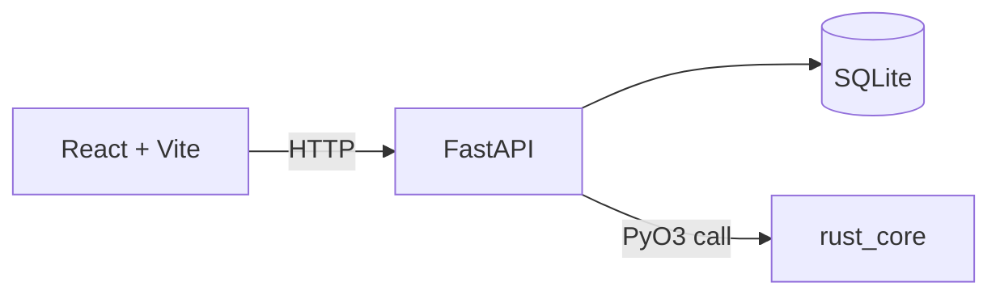

# DevShelf

**A technical resource library with a FastAPI backend and search ranking computed in Rust.**

Save articles, notes and snippets, tag them by category, and find them again with a relevance-ranked search.

🇫🇷 [Version française](README.fr.md)


> The interface and the sample data are in French. The code, the API and this documentation are in English.

## What it does

- **Add resources** with a title, a category and a body of text
- **Search with relevance ranking**, computed in Rust: a match in the title counts three times more than a match in the content, and the score is normalised by document length
- **Automatic metadata** computed in Rust on every new resource: word count, estimated reading time and the five most frequent keywords (stop words excluded)
- **Live API status** shown in the UI

## Architecture



| Folder | Role | Tools |
| --- | --- | --- |
| `frontend/` | List, add and search resources | React 19, Vite |
| `backend-python/` | HTTP API and persistence | FastAPI, SQLModel, SQLite |
| `rust-core/` | Text analysis and search ranking, compiled as a native Python module | Rust, PyO3, maturin |

The Rust crate is not a side demo: it is built into a shared library and imported directly in Python (`import rust_core`). The API calls it to analyse each resource at creation time and to rank every search.

## Getting started

Prerequisites: Python 3.9+ (tested with 3.10), a [Rust toolchain](https://rustup.rs/), and Node.js 20.19+ (22 LTS recommended).

```bash
git clone https://github.com/as9ardth0r/devshelf.git
cd devshelf
```

**1. Backend and Rust module**

```bash
cd backend-python
python3 -m venv venv
source venv/bin/activate
pip install -r requirements.txt      # includes maturin

cd ../rust-core
maturin develop --release            # builds rust_core into the active venv

cd ../backend-python
uvicorn main:app --reload
```

The API runs on <http://localhost:8000> (interactive docs on `/docs`). The SQLite database `devshelf.db` is created on first start.

**2. Sample data** (in a second terminal, with the API running)

```bash
cd backend-python
python3 seed.py
```

It loads [`seed_resources.json`](seed_resources.json) through the API and skips titles that already exist, so it is safe to run twice.

**3. Frontend**

```bash
cd frontend
npm install
npm run dev
```

Open <http://localhost:5173>. The badge at the top should read **API : en ligne**.

## API

| Method | Route | Description |
| --- | --- | --- |
| `GET` | `/health` | Health check |
| `GET` | `/resources/` | List all resources |
| `POST` | `/resources/` | Create a resource (`title`, `category`, `content`); metadata is computed in Rust |
| `GET` | `/resources/{id}` | Get one resource |
| `GET` | `/resources/search/?q=...` | Search, ordered by relevance (Rust) |

## Project status

MVP: the core loop (add, store, search, rank) works end to end. Rust unit tests cover the tokenizer and the title weighting in the ranking.

Possible next steps:

- Smarter keywords: a larger stop-word list and stemming, so that "accélérer" and "accélère" count as one term
- API tests with pytest
- Language switch for the interface
- Docker setup for one-command start

## Author

**Joel Broutin**: freelance developer.

- Portfolio: <https://as9ardth0r.github.io/portfolio>
- LinkedIn: <https://www.linkedin.com/in/joel-broutin-177856437/>
- Malt: <https://www.malt.fr/profile/joelbroutin>

Open to freelance missions: get in touch through any of the links above.

## License

MIT, see [LICENSE](LICENSE).
